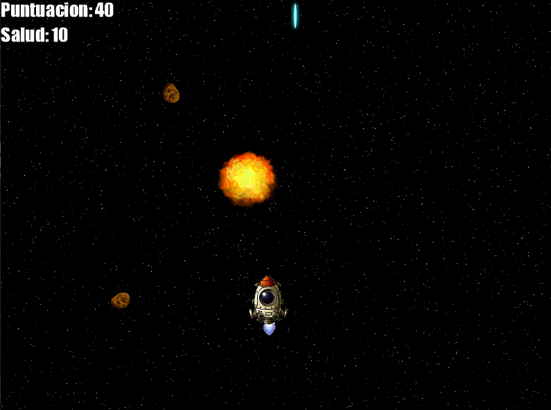

# Space Mission

This is a video game about an space mission. It was inspired by [Metal Slug](https://es.wikipedia.org/wiki/Metal_Slug). I have been always excited regarding any topic related to VideoGames. Unfortunatly, I have not had the opportunity to incursion on that field. This proyect reflect how much I love VideoGame moreover how much I would have loved to work on that field some time.

It made using XNA framework during 2015 if I am not wrong. XNA was deprecated after some time and now [Monogame](https://www.monogame.net/) implements it under the hood. 

You can find in this repository all the files needed to run the game and see the code that makes it possible. Sadly, I was not able not create a wizard which allow you to install it easily because I was a begineer. However, I have added some [instructions](#installation) to have the project alive in your computer.

## Installation
- You need to install XNA Framework, go to XNA Game Studio 4.0.4 folder and open README file, follow the instructions.
- After you have installed XNA Framework you can run `SpaceMision.exe` file within __dist__ folder.

## Features

### Main Menu
It has a start menu with three options:
- Start game
- Records
- Exit

### Save your record
Once the game is over, you will see an screen to save your initials. It just allow 3 letters.

Here some actions that you need to known about:
- To change between letters, use either left or right **direction arrow**.
- To confirm the current letter, press the key **Enter/Intro**.

## Play
- To move the spaceship, use **direction arrows** (up, down, left, right).
- To shot, use the key **space**.

### Home

### Level 1

### Level 2

### Level 3

### Save record

### List records

## Awesome things
Some interesting thing is that in the final level your will be targeted by enemies. I applied some mathematical formulas to achieve this behaviour 😉